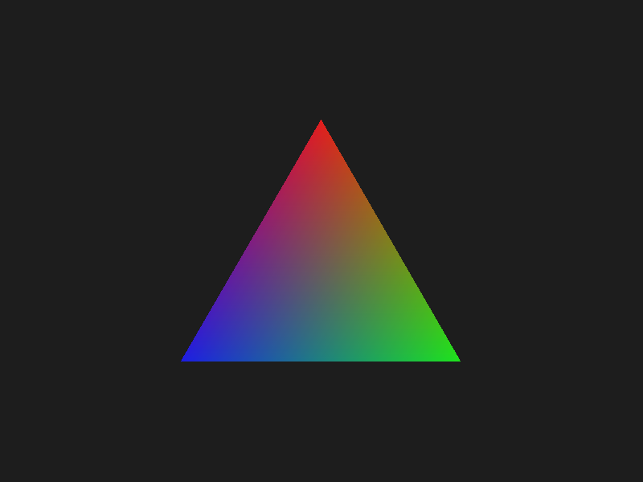
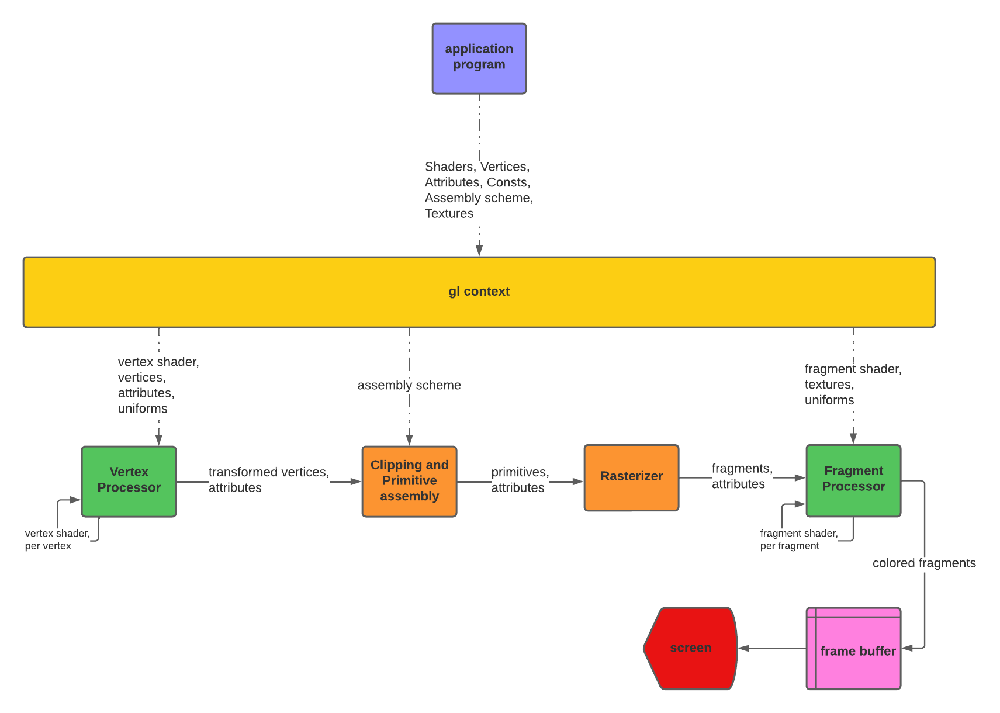

# Implementing the Graphics Pipeline

This project was a part of Summer Tehqiq Research Program 2022. The design of the pipeline is pretty much inspired from the WebGL and I had tried to conserve and replicate the syntax and basic logic as it was in WebGL into out pipeline.

This is one of the output form the pipeline.

<p align="center">

</p>

The design of the pipeline is, the pipeline is a series of stages that are executed in order.

<p align="center">

</p>

Every thing is connected to GL context that stores all the information about the rendering process. Except the application program everything is a class. Clipping and Primitive Assembly stage and Rasterization stage are the two which are parallellized through vectorization.

In this design, stages took the following time to reder the Plank's Triangle for 512 by 512 view port.

```
Vertex shader time: 8.106231689453125e-05
Clipper time: 0.0001385211944580078
Rasterizer time: 1.020097255706787
Fragment shader time: 0.12367510795593262
```

The limitation of the pipeline is that it can only render multiple objects with assembly scheme. There is no mechanism for the depth and transperency.
